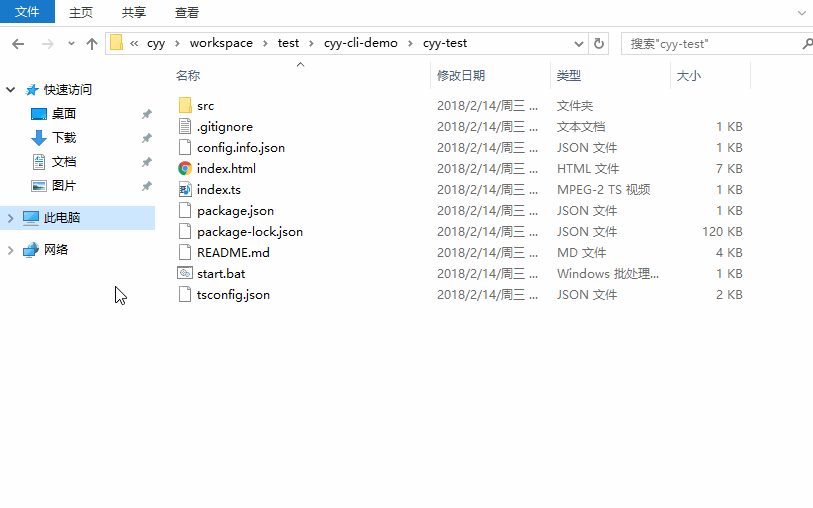

# cyy-cli

一个非常简单的项目模板生成的工具，开发者可以通过输入指定的命令，然后在命令行界面中根据提示操作生成你想要的项目模板。此外，用户还可以依照提供的项目模板仓库配置文件的格式，通过指定命令上传自己的模板仓库配置文件，由此实现添加各种项目模版仓库。

## 使用场景

##### 场景一：

一个较大的 SPA 项目，使用 SPA 框架开发，3个人负责开发，如果每个开发人员都自己配置一套 SPA，后期合并代码就会非常麻烦，这时组长可以自己先写好一个模版上传，然后每个开发人员通过 cyy-cli 下载即可。

##### 场景二：

单页活动需求较多，而每次开发人员都有可能不同的情况下，可以提前写好一个模版上传，，然后每个开发人员通过 cyy-cli 下载即可。

## 工作策略

根据输入的模板信息，在你上传的 repo.config.json 里面找到对应的项目模板仓库地址，先删除之前已下载的本地旧模板，然后通过仓库地址拉取最新的模板，最后把项目模板改成你输入的项目名，复制到你当作命令行执行的目录下，同时生成的项目模板信息文件 config.info.json 到模板文件里面。

## 开发/运行环境

node 9.1.0

注：尽量使用高版本的 node，否则有可能会提示语法不支持。

## 安装

```bash
npm install cyy-cli -g

# 推荐 cnpm 方式安装
cnpm install cyy-cli -g
```

## 命令

生成模板

```bash
cyy-cli
```

#### 注：默认模版仓库里面是随便填写的 github 仓库，国内克隆速度比较慢，建议您重新上传模版仓库配置文件里填写局域网或者国内的代码托管平台仓库。

上传模版（必须是 json 格式文件）

```bash
cyy-cli upload xxx.json
```

下载参考模版（下载下来参考，改成你的配置然后重新上传）

```bash
cyy-cli download
```

重置成默认的参考模版（当你上传的配置文件格式错误导致无法使用的时候使用）

```bash
cyy-cli reset
```

查看当前安装的 cyy-cli 版本

```bash
cyy-cli -V
```

查看 cyy-cli 帮助信息

```bash
cyy-cli -h

# 或者
cyy-cli --help
```

#### repo.config.json 文件说明

repo.config.json 默认配置文件结构说明

```bash
├── 请选择平台类型                             
├── PC端                         # 1层 单选项 
├── APP端                        # 2层 单选项                    
│   ├── 请选择APP端类型                                
│   ├── >react-native框架                                 
│   ├──  weex框架                                      
│   ├──  mui框架                           
│   └──  ionic框架                        
├── 移动端                       # 3层 单选项                           
│   ├── 请选择移动端类型                                 
│   ├── >单页应用       
│   │      ├── >react框架    
│   │      ├──  angular框架    
│   │      └──  vue框架                   
│   └──  活动           
│         ├── >普通    
│         └──  抽奖    
├── 项目名                       # 必填输入项    
├── 开发人员                     # 必填输入项   
├── 上线时间-年                  # 必填输入项   
├── 上线时间-月                  # 必填输入项   
└── 上线时间-日                  # 必填输入项                          
```

repo.config.json 默认参考配置文件，可使用 cyy-cli download 命令把这个配置文件下载下来修改成你想要的结构

字段说明：

```json
"message"   //  必填，单选/输入项的操作提示
"type"      //  必填，单选项内容，list 为单选项，input 为输入项
"name"      //  必填，唯一值，用于模版层级识别 
"text"      //  单选项显示的选项文字
"child"     //  非必填，如果此层下面没有子选项了，可不填该属性
```

```json
[{
        "type": "list",
        "message": "请选择平台类型",
        "name": "plaform",
        "text": "平台",
        "child": [{
                "name": "mobile",
                "text": "移动端",
                "child": [{
                    "name": "spa",
                    "text": "单页应用框架",
                    "child": [{
                        "name": "react",
                        "text": "react框架",
                        "url": "https://github.com/chenyaoyi88/cyy-tool.git"
                    }, {
                        "name": "angular",
                        "text": "angular框架",
                        "url": "https://github.com/chenyaoyi88/cyy-tool.git"
                    }, {
                        "name": "vue",
                        "text": "vue框架",
                        "url": "https://github.com/chenyaoyi88/cyy-tool.git",
                        "child": [{
                            "name": "cli",
                            "text": "vue-cli",
                            "url": "https://github.com/chenyaoyi88/cyy-tool.git"
                        }]
                    }]
                }, {
                    "name": "act",
                    "text": "活动",
                    "child": [{
                        "name": "webpack",
                        "text": "h5-webpack",
                        "url": "https://github.com/chenyaoyi88/h5-webpack.git"
                    }, {
                        "name": "parcel",
                        "text": "h5-parcel",
                        "url": "https://github.com/chenyaoyi88/h5-parcel.git"
                    }]
                }]
            },
            {
                "name": "pc",
                "text": "PC端",
                "child": [{
                    "name": "spa",
                    "text": "单页应用框架",
                    "child": [{
                        "name": "react",
                        "text": "react框架",
                        "url": "https://github.com/chenyaoyi88/cyy-tool.git"
                    }, {
                        "name": "angular",
                        "text": "angular框架",
                        "url": "https://github.com/chenyaoyi88/cyy-tool.git"
                    }, {
                        "name": "vue",
                        "text": "vue框架",
                        "url": "https://github.com/chenyaoyi88/cyy-tool.git"
                    }]
                }, {
                    "name": "act",
                    "text": "活动",
                    "url": "https://github.com/chenyaoyi88/cyy-tool.git",
                    "child": [{
                        "name": "lottery",
                        "text": "抽奖",
                        "url": "https://github.com/chenyaoyi88/cyy-tool.git"
                    }]
                }]
            },
            {
                "name": "app",
                "text": "APP端",
                "child": [{
                    "name": "react-native",
                    "text": "react-native框架",
                    "url": "https://github.com/chenyaoyi88/cyy-tool.git"
                }, {
                    "name": "weex",
                    "text": "weex框架",
                    "url": "https://github.com/chenyaoyi88/cyy-tool.git"
                }, {
                    "name": "mui",
                    "text": "mui框架",
                    "url": "https://github.com/chenyaoyi88/cyy-tool.git"
                }, {
                    "name": "ionic",
                    "text": "ionic框架",
                    "url": "https://github.com/chenyaoyi88/cyy-tool.git"
                }]
            }
        ]
    },
    {
        "type": "input",
        "name": "appName",
        "message": "请输入项目名"
    },
    {
        "type": "input",
        "name": "author",
        "message": "请输入开发人员名字"
    },
    {
        "type": "input",
        "name": "onlineYear",
        "message": "上线时间-年"
    },
    {
        "type": "input",
        "name": "onlineMonth",
        "message": "上线时间-月"
    },
    {
        "type": "input",
        "name": "onlineDate",
        "message": "上线时间-日"
    }
]
```

#### 操作如下图


生成项目模版操作流程


cli输入时候填写的项目信息



 ```json
{
    "appName": "cyy-test",
    "author": "cyy",
    "onlineYear": "2018",
    "onlineMonth": "12",
    "onlineDate": "01",
    "createYear": "2018",
    "createMonth": "02",
    "createDate": "14"
}
 ```
