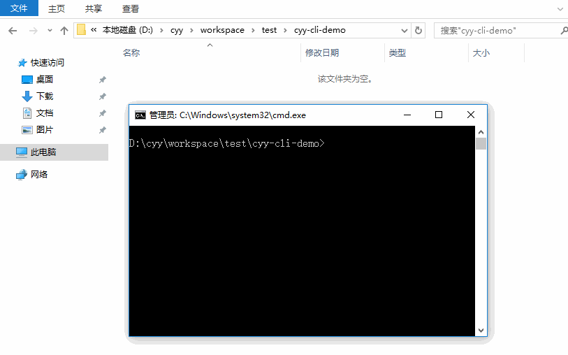

# cyy-cli

一个非常简单的通过命令生成模板的工具。

## 目标

全局安装之后，可以在命令行界面通过可视化选择方式或者直接输入命令的方式快速生成各种项目的基本架子。

## 目前进度

为了让模版和 cli 完全分离成两个项目去维护，所以把写死在 cli 里面的模版删除了，改成了每次直接从 github 上面去获取，克隆到 cli 的 template 文件夹里面，然后再 copy 到当前 Node.js 进程执行时的工作目录，目前这个版本是这样的，但是速度着实有点慢，让人捉急，下一步看看如何优化。


## 安装

```bash
npm install cyy-cli -g

// 推荐 cnpm 方式安装
cnpm install cyy-cli -g
```
## 生成模板

```bash
cyy-cli
```

#### 操作如下图




